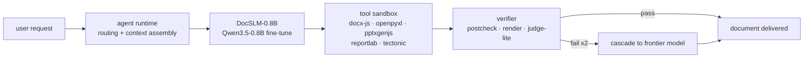

# DocSLM-0.8B

A domain-specialized **small language model** — a fine-tune of **Qwen3.5-0.8B** — that runs the ZCode `document-skills` agent stack (docx / pdf / pptx / xlsx + judge) **locally**: cheap, fast, private, offline-capable, with graceful escalation to a frontier model for the ~15% of tasks it can't close.



**Why this can work at 0.8B:** the document-skills stack is recipe-constrained and fully machine-verifiable — scripts execute or fail, `postcheck.py` passes or fails, rendered pages pass or fail the judge. Verifiable domains are exactly where small models trained against execution-grounded rewards reach competence.

## Documentation

| Doc | Contents |
|---|---|
| [01 — PRD](docs/01_PRD.md) | problem, goals, personas, functional requirements, success metrics, 14-week milestones, risks |
| [02 — Architecture](docs/02_ARCHITECTURE.md) | system, agent-loop, context assembly, verification stack, cascade, training system, ADRs |
| [03 — Data Engine](docs/03_DATA_ENGINE.md) | task taxonomy, teacher rollouts, rejection sampling, repair mining, licensing & manifests |
| [04 — Training Pipeline](docs/04_TRAINING_PIPELINE.md) | CPT → SFT → DPO/GRPO → quantization, hyperparameters, infra, gates |
| [05 — Evaluation](docs/05_EVALUATION.md) | DocBench, metrics, ablations, gates, red-team suite |
| [06 — Deployment](docs/06_DEPLOYMENT.md) | GGUF/AWQ artifacts, llama.cpp & vLLM serving, ZCode integration, security, rollout |
| [07 — Datasets](docs/07_DATASETS.md) | The built training batch: schemas, verification guarantees, rebuild/scale-out |
| [08 — Novita 4090 Training](docs/08_NOVITA_4090_TRAINING.md) | Renting an RTX 4090 on novita.ai and running the SFT stage end-to-end (runbook) |

## Training data (built)

`datasets/` ships a **verified, English-only batch with uniform function coverage and reasoning traces**: 930 SFT trajectories — **all 30 document-skills capabilities at exactly 31 records each** (equal weights, enforced by the validator), every assistant turn carrying a grounded `<think>` block (plan → failure diagnosis → targeted patch → verification), 573 with executed repair turns — plus 240 reasoning-contrastive preference pairs and 1,240 reasoning routing labels. Every record ran against the plugin's real tooling (`postcheck.py`, `pdf.py`, `xlsx.py`, `pdf_qa.py`, TOC/footer repair scripts, `document.py`). Rebuild or scale with:

```bash
python3 -m data_engine.build --n-sft 930 --n-routing 1240 --n-pref 240 --seed 2026
python3 -m data_engine.validate
```

The engine (`data_engine/`) is the reusable factory: stratified task sampler → code generators (docx-js / python-docx / openpyxl / pptxgenjs / reportlab) → 13 verified mutation classes for the repair curriculum → sandboxed execution + verification → manifest & validation gate. See [docs/07_DATASETS.md](docs/07_DATASETS.md).

## Base model facts (Qwen3.5-0.8B, released Mar 2026)

- 0.8B params, 24 layers, hidden 1024 — full fine-tune fits one 24–80 GB GPU
- Natively multimodal (text + vision) → enables **judge-lite** page checks in-model
- 262k-token native context; we train at 16k with retrieval-based context assembly
- ~0.5 GB at Q4 GGUF; Apache-2.0; GGUF/MLX/Snapdragon builds already exist

## Headline targets (v1 launch)

| Metric | Target |
|---|---|
| Execution success (create routes, DocBench) | ≥ 85% |
| Judge acceptance | ≥ 70% |
| Self-repair within 2 turns | ≥ 60% |
| Cascade rate | ≤ 15% |
| TTFT / decode on 8-core laptop CPU | ≤ 400 ms @ 8k / ≥ 25 tok/s |
| Resident memory (Q4_K_M) | ≤ 1.2 GB |

## Sources

- [Qwen/Qwen3.5-0.8B — Hugging Face](https://huggingface.co/Qwen/Qwen3.5-0.8B)
- [Qwen3.5 small models overview — Artificial Analysis](https://artificialanalysis.ai)
- [Qwen3.5 model family — ModelScope](https://modelscope.cn/models/unsloth/Qwen3)
