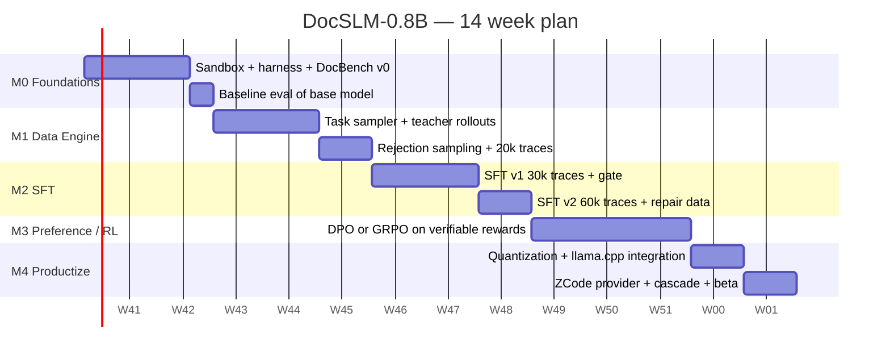

# PRD — DocSLM-0.8B

**Product:** DocSLM-0.8B — a domain-specialized small language model that runs the document-skills agent stack (docx / pdf / pptx / xlsx + judge) locally, without a frontier-model API.

| Field | Value |
|---|---|
| Status | Draft v1.0 |
| Owner | DocSLM working group |
| Base model | Qwen3.5-0.8B (Base + Instruct variants, released Mar 2026) |
| Target release | 14 weeks from kickoff (M0–M4) |
| Related docs | [Architecture](02_ARCHITECTURE.md) · [Data Engine](03_DATA_ENGINE.md) · [Training](04_TRAINING_PIPELINE.md) · [Evaluation](05_EVALUATION.md) · [Deployment](06_DEPLOYMENT.md) |

---

## 1. Problem statement

The ZCode `document-skills` plugin delivers high-quality document automation — DOCX creation/editing with validated cover recipes, PDF production across four workflows, PPTX generation, and spreadsheet engineering — but every step today is executed by a frontier-scale LLM. That means:

- **Cost.** A single multi-page DOCX with a repair loop can burn 100k+ output tokens of frontier-model traffic; batch jobs (monthly report fleets, bulk contract generation) are prohibitively expensive.
- **Latency.** Round trips to a remote API add seconds per tool-call turn and tens of seconds per document.
- **Privacy.** Contracts, resumes, financial models, and internal reports must leave the machine.
- **Availability.** Offline and air-gapped environments get nothing at all.

Meanwhile, the document-skills stack is unusually *SLM-friendly*: workflows are explicitly routed (task router → scene router → reference files), generation is recipe-constrained (7 validated cover recipes, mandatory formatting rules), and every artifact is **machine-verifiable** (scripts execute or fail; `postcheck.py` passes or fails; rendered pages pass or fail the judge). Verifiability is exactly what makes a 0.8B model trainable to competence in a narrow domain.

**DocSLM-0.8B** is a fine-tune of Qwen3.5-0.8B that exploits this: strict domain scoping, context assembly from the skill corpus, and training against execution- and judge-grounded rewards.

### Why Qwen3.5-0.8B as the base

| Property | Value | Why it matters here |
|---|---|---|
| Parameters | 0.8B (24 layers, hidden 1024) | Full fine-tune fits on one 24–80 GB GPU; Q4 GGUF ≈ 0.5 GB |
| Context | 262,144 tokens native | We train at 16k; headroom for full route+scene+reference context assembly |
| Modality | Natively multimodal (vision + text) | Enables **judge-lite**: the model can inspect rendered page thumbnails itself |
| License | Apache-2.0 (Qwen small-model family) | Commercial use, fine-tuning, and redistribution of derivatives |
| Ecosystem | GGUF / MLX / Qualcomm AI Hub builds exist | On-device CPU, Apple Silicon, and Snapdragon paths are already paved |

---

## 2. Goals and non-goals

### Goals

1. **G1 — Local doc-agent competence.** DocSLM-0.8B completes end-to-end document tasks (create / edit / format / comment / read across the four skills) with a ≥ 85% script-execution success rate and ≥ 70% judge acceptance on held-out DocBench create-route tasks.
2. **G2 — Self-repair.** When a generated script fails or `postcheck.py` reports violations, the model repairs its own output; ≥ 60% of failures resolved within 2 repair turns.
3. **G3 — On-device economics.** Full agent loop runs on a modern laptop CPU: TTFT ≤ 400 ms at 8k prompt context, ≥ 25 tok/s decode, ≤ 1.2 GB resident memory at Q4_K_M.
4. **G4 — Graceful escalation.** A cascade policy hands unresolvable tasks to a frontier model after ≤ 2 failed local repair cycles; measured cascade rate ≤ 15% on DocBench.
5. **G5 — Judge-lite.** The multimodal head produces usable first-pass page verdicts (agreement ≥ 80% with the full judge on pass/fail) so the loop can close without any external model.

### Non-goals (v1)

- General chat, reasoning, or coding ability beyond the document domain (we accept regression elsewhere; the model is a specialist).
- Long-document *content* authorship (writing a 40-page thesis body) — v1 focuses on structure, formatting, layout, data-driven population, and editing, with content supplied or outlined by the user/teacher.
- OCR of scanned documents, handwriting, or complex table extraction from images (existing-pdf route covers text-native PDFs only).
- Training a replacement for the full VLM judge on poster/creative aesthetics; judge-lite covers gross layout defects only.
- Fine-tunes of larger siblings (2B/4B) — evaluated later as scale-ups, out of v1 scope.

---

## 3. Target users and use cases

### Personas

- **P1 — ZCode power user.** Runs document-skills daily; wants instant, private drafts locally and only pays for the final polish pass.
- **P2 — Batch operations owner.** Generates document fleets (contracts from templates, monthly department reports, invoice/workbook exports). Sensitive to per-document cost and throughput.
- **P3 — Offline / regulated user.** Air-gapped or data-residency-constrained (legal, government, healthcare). Local-only is a hard requirement, not a cost preference.

### Primary use cases

| # | Use case | Route(s) | Success looks like |
|---|---|---|---|
| UC-1 | "Create a quarterly business report DOCX from this outline" | docx/create + scenes/report | Executes, postcheck passes, judge accepts, TOC/page numbers correct |
| UC-2 | "Add comments to this contract and track-change two clauses" | docx/comment, docx/edit | Revisions/comments land at the right anchors; file opens clean in Word |
| UC-3 | "Build a 3-sheet financial model with formulas and charts" | xlsx/create + scenes/finance | Formulas compute (no `#REF!`), charts reference correct ranges |
| UC-4 | "Make a 10-slide pitch deck from this markdown" | pptx/create | Slides render, no overflow, master/theme consistent |
| UC-5 | "Set this paper with LaTeX to 2-column ACM format" | pdf/academic | Tectonic compiles first try; bibliography and floats resolve |
| UC-6 | "Merge these 12 PDFs, extract tables to XLSX" | pdf/process + xlsx | Correct page order, clean table schema |
| UC-7 | Nightly batch: 500 contract variants | all | ≥ 95% unattended completion incl. repairs; rest flagged for human review |

---

## 4. Functional requirements

Priorities: **M** = must (blocks v1 release), **S** = should, **C** = nice/could.

### 4.1 Agent core

| ID | Priority | Requirement |
|---|---|---|
| FR-1 | M | **Skill & route routing.** Given a user request, select skill (docx/pdf/pptx/xlsx), route (create/edit/format/comment/read; pdf briefs: report/creative/academic/process), and scene (report, contract, resume, exam, academic, official-doc, copywriting, finance, analyze, …) with ≥ 95% accuracy on the routing benchmark. |
| FR-2 | M | **Context assembly.** Pack the SKILL.md quick-route + selected route file + scene file + `design-system.md` / `common-rules.md` excerpts into a ≤ 12k-token working prompt; retrieve reference files (ooxml, toc, chart-templates, math-formulas) on demand via tool call. |
| FR-3 | M | **Tool calling.** Emit and consume OpenAI-compatible function calls: `run_python`, `run_node`, `read_file`, `write_file`, `load_reference`, `postcheck`, `render_pages`, `judge_lite`, `escalate`. Strict JSON, no free-form tool syntax. |
| FR-4 | M | **Code generation (create routes).** docx-js for DOCX creation; OOXML patching for edits; openpyxl + the skill's `xlsx.py` for spreadsheets; pptxgenjs for decks; ReportLab / Playwright-HTML / Tectonic-LaTeX per pdf brief. |
| FR-5 | M | **Recipe compliance.** Always build covers via the `buildCoverRX()` recipes (R1–R7) from `design-system.md`; free-form cover code is a training-time hard negative and a runtime postcheck failure. |
| FR-6 | M | **Verification loop.** After each artifact: run `postcheck.py` (docx) / dependency & compile checks (pdf) / workbook recalculation (xlsx) / render-and-measure (pptx); on failure, read the diagnostics and produce a targeted patch (not a full regen). |
| FR-7 | M | **Self-repair budget.** ≤ 2 repair turns per artifact, then escalate (FR-9). |
| FR-8 | M | **Formatting-rule discipline.** Apply the Latin/English formatting profile correctly (Times New Roman/Arial, `line: 312` = 1.3x spacing, twip-unit math) and never mix profiles. English-only scope for v1. |
| FR-9 | M | **Cascade escalation.** Structured `escalate` call carrying the task, the failed artifact, and diagnostics, so the frontier model repairs rather than restarts. |
| FR-10 | S | **Judge-lite.** Given a rendered page PNG, output the judge JSON schema (verdict pass/fail + evidence) for gross defects: overflow, blank page, missing border, font tofu, chart corruption. |
| FR-11 | S | **Edit precision.** For edit routes, produce minimal OOXML diffs; measured edit precision ≥ 90% (no unintended formatting drift). |
| FR-12 | C | **Template memory.** Learn an organization's house style from 3–5 sample docs and apply it (v2 candidate). |

### 4.2 Runtime & productization

| ID | Priority | Requirement |
|---|---|---|
| FR-13 | M | **Serving.** Ship GGUF (Q4_K_M, Q5_K_M, Q8_0) served by llama.cpp with an OpenAI-compatible endpoint; optional AWQ/vLLM build for GPU batch. |
| FR-14 | M | **ZCode integration.** Register as a ZCode model provider + document-skills execution mode ("local-first"); per-workspace opt-in. |
| FR-15 | M | **Sandbox.** All code executes in a restricted sandbox: workspace-path allowlist, no network, CPU/time/memory caps. |
| FR-16 | S | **Telemetry.** Opt-in, local-only metrics: route accuracy, repair success, cascade rate, latency histograms. |
| FR-17 | S | **Graceful degradation.** If the vision head is disabled (CPU-only low-RAM mode), judge-lite is skipped and postcheck-only verification is used with a stricter repair threshold. |

---

## 5. Non-functional requirements

| Dimension | Requirement |
|---|---|
| Latency | TTFT ≤ 400 ms and ≥ 25 tok/s at 8k ctx on 8-core laptop CPU (Q4_K_M); ≥ 150 tok/s on a single mid-range GPU with vLLM |
| Memory | ≤ 1.2 GB weights+KV at 16k ctx, Q4_K_M |
| Footprint | Installer bundle (weights + skill corpus index) ≤ 1 GB |
| Quality gates | Ship gates in [05_EVALUATION.md](05_EVALUATION.md) §4; every checkpoint re-gated in CI |
| Robustness | Zero data-loss guarantee: edits are staged as patches; original files never overwritten without a `.bak` |
| Safety | Code execution sandboxed (FR-15); no prompt-injected instruction execution from document content without user confirmation |
| License | Apache-2.0 base weights; training data licensed/cleaned for commercial redistribution of the fine-tune (see Data Engine §6) |
| Reproducibility | Training runs pinned by data manifest hash + seed; every released checkpoint has a DVC/W&B lineage entry |

---

## 6. Success metrics (v1 launch criteria)

| Metric | Definition | Target |
|---|---|---|
| Execution success | % DocBench tasks whose final script runs clean | ≥ 85% (create routes) |
| Postcheck pass | % artifacts passing `postcheck.py` / equivalent | ≥ 80% |
| Judge acceptance | % pages accepted by full VLM judge | ≥ 70% |
| Repair success | % failures fixed in ≤ 2 turns | ≥ 60% |
| Cascade rate | % tasks escalated | ≤ 15% |
| Routing accuracy | skill/route/scene selection | ≥ 95% |
| Judge-lite agreement | pass/fail agreement with full judge | ≥ 80% |
| Cost per doc (batch) | amortized $ per UC-7 contract on CPU | ≤ $0.001 electricity-equivalent |
| Latency p50 | single doc (UC-1), CPU | ≤ 45 s end-to-end |

---

## 7. Milestones and timeline

- **M0 (wk 1–2):** execution sandbox mirroring the plugin's scripts; agent harness with OpenAI tool-calling; DocBench v0 (200 tasks); base-model baseline (expect ~20–35% execution success — this number justifies the project).
- **M1 (wk 3–5):** data engine v1; 20k accepted teacher traces; routing classifier data.
- **M2 (wk 6–8):** SFT v1 → gate A (≥ 70% execution success); add mined repair traces → SFT v2.
- **M3 (wk 9–11):** preference optimization (DPO) or GRPO with execution/postcheck/judge rewards → gate B (ship-level quality targets).
- **M4 (wk 12–14):** quantization, llama.cpp + ZCode provider, cascade policy, judge-lite calibration, beta release.

---

## 8. Risks and mitigations

| Risk | Likelihood | Impact | Mitigation |
|---|---|---|---|
| 0.8B capacity ceiling on multi-part tasks (UC-3 style) | High | Med | Decomposition-first training data; runtime task splitter; cascade for multi-intent requests |
| Hallucinated library APIs (docx-js/openpyxl drift) | High | High | Execution-filtered training only; version-pinned API cheat-sheet in context; postcheck catches the rest |
| Non-English request handling | Med | Low | v1 is English-only by design; out-of-language requests route to a clear refusal-and-escalation message rather than degraded output |
| Judge-lite (0.8B vision) too weak to be useful | Med | Low | It is advisory only; postcheck + cascade are the guarantees; disable per FR-17 |
| Reward hacking in RL (e.g., empty docs that pass postcheck) | Med | High | Composite reward includes content-completeness + judge; held-out canary tasks; RL stopped at first gate regression |
| Teacher-model data licensing | Low | High | Train from execution-filtered traces we generate; strip copyrighted source content; use synthetic/CC corpora (Data Engine §6) |
| Skill plugin updates invalidate trained knowledge | Med | Med | Train on normalized route/scene abstractions + version pinning; context assembly carries current files at runtime |

---

## 9. Open questions

1. Should the routing classifier be a separate tiny head (fast, deterministic) or the SLM itself (simpler stack)? — decide at M1 with latency data.
2. GRPO vs DPO for stage 3: GRPO gives bigger gains with verifiable rewards but needs live sandbox rollouts in the training loop; DPO is cheaper. Current plan: DPO first, GRPO if gate B missed.
3. Do we ship a 2B "Pro" sibling at M4+ for users who fail the 15% cascade budget? (Business call, not technical.)
4. Should judge-lite be a separate LoRA adapter (swapped in during verification) to keep the main adapter chat-clean?
