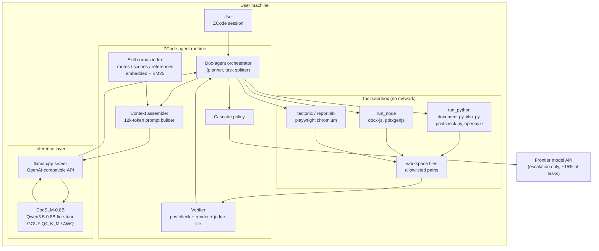
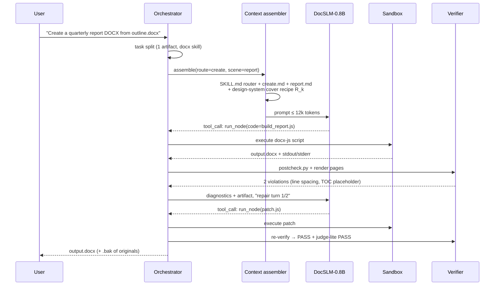
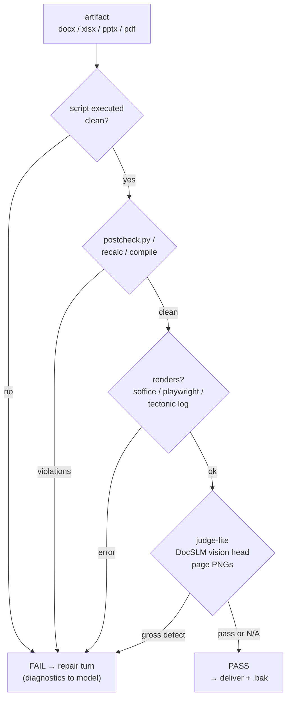
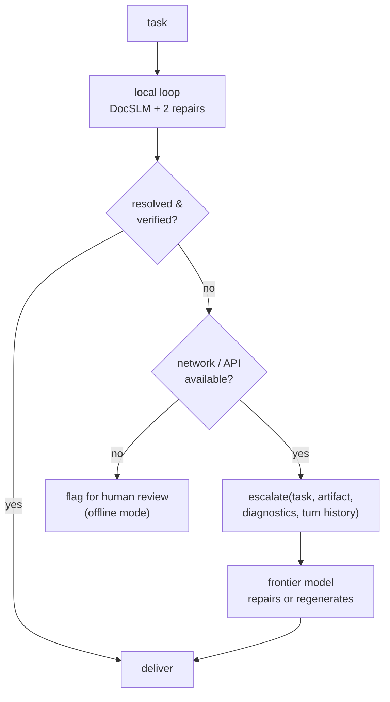
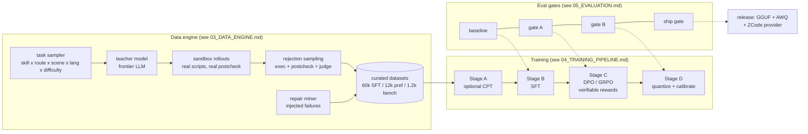

# Architecture — DocSLM-0.8B

This document describes the runtime system architecture, the training system architecture, and how DocSLM-0.8B plugs into ZCode's document-skills plugin. All diagrams are Mermaid and render on GitHub.

---

## 1. System context

DocSLM-0.8B is **one component** inside an agent stack, not a standalone chatbot. The stack keeps the document-skills plugin exactly as it is — SKILL.md routing, route/scene/reference files, `scripts/*.py`, the judge agent — and replaces *only* the model that drives the loop.



**Design principle — "thin model, thick environment":** a 0.8B model cannot *know* the whole skill corpus, so intelligence is pushed into four places outside the weights:

1. **Skill corpus index** — the plugin's own markdown (routes, scenes, references) is chunked, embedded, and retrieved at runtime. The model learns the *method*; the files carry the *details*.
2. **Context assembler** — deterministically packs router tables, the selected route + scene, and rule excerpts into a ≤ 12k-token prompt so the model never has to guess structure.
3. **Verifier** — execution results, `postcheck.py`, page rendering, and judge-lite convert "good document" into machine signals.
4. **Cascade** — anything the loop cannot close locally escalates with full diagnostics.

---

## 2. Agent runtime — the document loop

The runtime is a bounded ReAct-style loop (max 12 model turns, max 2 repair cycles per artifact). Every turn's tool result is fed back verbatim; the model was trained on exactly this loop's message format.



Loop guards:

| Guard | Value | Why |
|---|---|---|
| Max model turns / task | 12 | Multi-artifact tasks split at the orchestrator, not by looping forever |
| Max repair cycles / artifact | 2 | Then escalate (PRD FR-7/FR-9) |
| Regen policy | Forbidden after first execution | Repairs must be *targeted patches*; full regen is a hard negative in training |
| Token budget / turn | 4k output | Scripts longer than this signal a decomposition failure |

---

## 3. Context assembly (the SLM's "extended memory")

The document-skills corpus is ~30 markdown files. They are indexed, not finetuned-in wholesale:

```mermaid
flowchart LR
    subgraph corpus["Skill corpus (versioned with plugin)"]
        SKILL["SKILL.md x4"]
        Routes["routes/<br/>create, edit, format,<br/>comment, read"]
        Scenes["scenes/<br/>7 docx + xlsx scenes"]
        Refs["references/<br/>design-system, common-rules,<br/>ooxml, toc, charts, math, faq"]
    end
    Chunk["chunker<br/>per-section, heading-aware"]
    Emb["bge-small embedding<br/>+ BM25 hybrid index"]
    Query{"route + scene<br/>already resolved?"}
    Pack["prompt packer<br/>fixed skeleton:"]
    M["DocSLM-0.8B<br/>16k ctx"]

    SKILL & Routes & Scenes & Refs --> Chunk --> Emb
    Emb --> Query
    Query -- "yes" -->|"router tables + route + scene + R_k recipe"| Pack
    Query -- "on-demand ref" -->|"load_reference tool call"| Pack
    Pack -->|"~8-12k tokens"| M
```

Prompt skeleton (deterministic order, measured token budgets):

| Slot | Source | Budget |
|---|---|---|
| System: role, loop contract, tool schemas | fixed | 800 |
| Router tables (task + scene) | SKILL.md | 700 |
| Route instructions | `routes/<r>.md` | 2,500 |
| Scene spec | `scenes/<s>.md` | 1,500 |
| Design rules + cover recipe code | `design-system.md`, `common-rules.md` | 3,500 |
| Conversation + tool results | runtime | rest of 16k |
| On-demand (`load_reference`) | ooxml/toc/charts/math | paged in 2k chunks |

This is why a 0.8B model is viable: the highest-variance knowledge (units, spacing values, recipe code, API idioms) is always in-context; the model supplies routing judgment, content transformation, and code synthesis.

---

## 4. Verification stack



- **Layer 1 — execution:** exit code, stdout/stderr, timeouts. Absolute ground truth.
- **Layer 2 — skill postcheck:** `postcheck.py` (docx formatting rules), workbook recalculation via LibreOffice headless (`xlsx`), `pdf.py env.check` + compile logs, pptx render smoke test.
- **Layer 3 — judge-lite:** DocSLM's own vision head scores rendered page PNGs into the judge JSON schema (pass/fail + evidence). Advisory: it gates a repair turn, never a final rejection (that's the cascade's call, or the full VLM judge when online).
- The full **judge agent** (frontier VLM reading page PNGs) runs only in cascade mode and in the training/eval loops as ground-truth generator.

---

## 5. Cascade and escalation



Offline mode (P3 persona) degrades explicitly: no cascade, tasks that fail the loop are flagged with diagnostics attached, and the artifact plus a repair transcript are left for the user.

---

## 6. Training system architecture



Training cluster: **2× A100-80GB** (full fine-tune + RL rollouts) plus a **CPU sandbox pool** (16–32 workers) executing rollouts and verifications. The sandbox pool runs the *identical* container image as production runtime, so training rewards and production verification can never drift.

---

## 7. Component inventory

| Component | Tech | Owns | Doc |
|---|---|---|---|
| Orchestrator | Python, asyncio | task split, loop guards, cascade | this doc §2 |
| Skill corpus indexer | chunker + bge-small + BM25 (sqlite) | retrieval over plugin markdown | §3 |
| Context assembler | Python template packer | deterministic prompt skeleton | §3 |
| Inference server | llama.cpp `llama-server` / vLLM | OpenAI-compatible tools API | [06](06_DEPLOYMENT.md) |
| Tool sandbox | gVisor/docker, no network, path allowlist | run_python / run_node / tectonic | §2, [06](06_DEPLOYMENT.md) §5 |
| Verifier | plugin scripts + soffice + judge-lite | machine signals for the loop | §4 |
| Trainer | torch + TRL (SFT/DPO/GRPO), DeepSpeed not needed at 0.8B | stages A–D | [04](04_TRAINING_PIPELINE.md) |
| Data engine | teacher APIs + sandbox pool + DuckDB manifests | datasets | [03](03_DATA_ENGINE.md) |
| Eval harness | pytest + judge API + W&B | gates, regression CI | [05](05_EVALUATION.md) |

## 8. Key architectural decisions (ADR summary)

| # | Decision | Rationale | Alternative rejected |
|---|---|---|---|
| ADR-1 | Fine-tune Qwen3.5-0.8B full (not LoRA-only) | 0.8B is cheap to full-FT; capacity is the scarce resource, adapters leave capacity on the table | LoRA-only (kept as low-VRAM fallback) |
| ADR-2 | Skill knowledge via retrieval, not weights | Plugin files update monthly; context assembly carries changes without retraining | Bake references into CPT only |
| ADR-3 | OpenAI-compatible tools API as the only action channel | Matches ZCode provider model; train/serve parity of message format | Custom grammar / text protocol |
| ADR-4 | Repairs as patches, never full regen | Deterministic postcheck diffs make patch data easy to mine; regen wastes tokens and reintroduces variance | Regen-on-failure |
| ADR-5 | Judge-lite advisory, postcheck authoritative | 0.8B vision is too weak to gate final delivery; but it catches gross defects cheaply inside the loop | Judge-lite as hard gate |
| ADR-6 | Train loop on identical sandbox image as prod | Prevents reward/verification drift between training and runtime | Separate "training-only" verifier |
