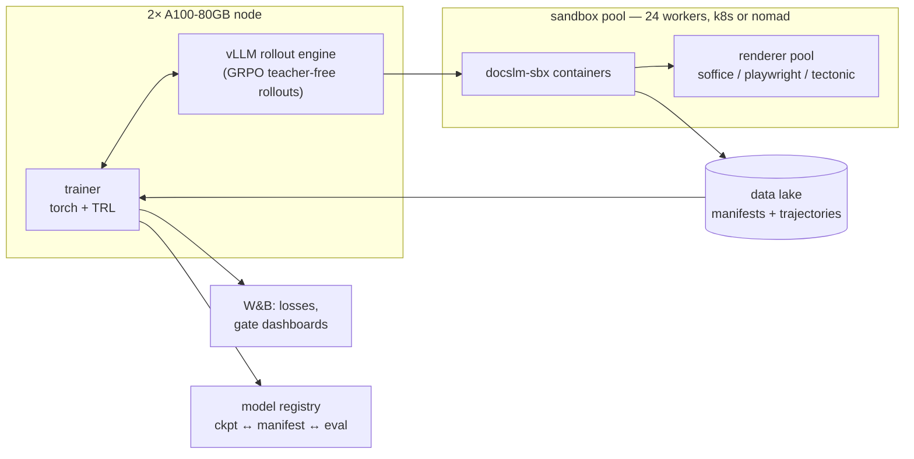

# Training Pipeline — DocSLM-0.8B

Four stages with hard eval gates between them. All stages run on the **same message format** as production inference (OpenAI tools format) — train/serve parity is non-negotiable (ADR-3), because format drift silently destroys small models.

```mermaid
flowchart TB
    Base["Qwen3.5-0.8B-Base<br/>Apache-2.0"] --> A
    subgraph A["Stage A — continued pretraining (optional)"]
        A1["doc-domain corpus<br/>~3B tokens"] --> A2["full FT, 16k seq"]
    end
    A --> GA{"gate A0:<br/>perplexity ≤ base<br/>on held-out doc corpus"}
    GA -- pass --> B
    GA -- fail -->|"re-mix data"| A1
    subgraph B["Stage B — supervised fine-tuning"]
        B1["60k execution-verified<br/>trajectories + 20k routing"] --> B2["full FT, loss on<br/>assistant tokens only"]
    end
    B --> GB{"gate A:<br/>exec ≥ 70% · postcheck ≥ 60%<br/>repair ≥ 40% · route ≥ 95%"}
    GB -- pass --> C
    GB -- fail -->|"data autopsy: top failure strata<br/>→ re-quota, add traces, resume"| B1
    subgraph C["Stage C — preference optimization"]
        C1{"DPO first<br/>GRPO only if gate B missed"}
        C2["DPO: 12k verifiable<br/>chosen/rejected pairs"]
        C3["GRPO: live sandbox rollouts,<br/>composite verifiable reward"]
        C1 --> C2
        C1 -.-> C3
    end
    C --> GC{"gate B:<br/>exec ≥ 85% · judge ≥ 70%<br/>repair ≥ 60% · cascade ≤ 15%"}
    GC -- pass --> D
    GC -- fail --> C3
    subgraph D["Stage D — productization"]
        D1["GPTQ/AWQ calibration<br/>+ GGUF export"] --> D2["judge-lite head calibration<br/>+ guardrail red-team"]
    end
    D --> Ship{"ship gate:<br/>gate B held at Q4_K_M<br/>+ latency NFRs"}
    Ship -- pass --> Release["DocSLM-0.8B v1.0"]

    style Release fill:#c8e6c9
```

---

## 1. Stage A — continued pretraining (CPT), optional

**Goal:** make library idioms (docx-js, python-docx, openpyxl, python-pptx, ReportLab, pikepdf, LaTeX/ctex), OOXML structure, and the plugin's markdown genre low-perplexity, so SFT budget is spent on *behavior*, not vocabulary.

| Item | Value |
|---|---|
| Corpus | library docs + tests (~1.2B tok) · Stack/StarCoder filtered to doc libs (~1.0B) · OOXML/MS-OFFXML specs + real small docx/xlsx internals dumps (~0.4B) · skill-corpus markdown + rendered-agent transcripts (~0.2B) · English-only |
| Tokens | ~3B (≈2 epochs effective) |
| Seq len | 16k, packed |
| Loss | full FT |

**Decision rule:** run Stage A only if the SFT pilot (5k traces) shows library-API error rate > 20%. A 0.8B model risks catastrophic forgetting; gate A0 requires held-out doc-corpus perplexity ≤ base and ≥ 95% of base score on a general mini-benchmark (MMLU-mini + a 200-task generic-instruct sample) — else skip Stage A and fold 10% general data into SFT instead.

## 2. Stage B — supervised fine-tuning

**Data:** 60k execution-verified trajectories + 20k routing examples (Data Engine §2), ≥ 25% of trajectories containing a successful repair turn.

| Hyperparameter | Value | Note |
|---|---|---|
| Fine-tune mode | **Full FT** (ADR-1) | 0.8B: params 1.6 GB bf16, +grads 1.6 GB, AdamW 12.8 GB → ~16 GB states |
| Hardware (primary) | 1× A100-80GB, bf16 | ~40k tok/s with packing |
| Hardware (min viable) | 1× RTX 4090-24GB | requires 8-bit Adam + activation checkpointing + seq 8k |
| LoRA fallback | r=64, α=128, all linear | if only 16 GB available; expect −3–6 pts on gate A |
| Seq len | 16,384 tokens, packed | matches production context assembly budget |
| LR | 1e-5, cosine → 10% , 3% warmup | full-FT scale for 0.8B |
| Global batch | 128 sequences (~2M tokens) | grad accum as needed |
| Epochs | 3 | early-stop on gate-A dev strata |
| Precision | bf16, grad clip 1.0 | |
| Token budget | 60k × ~6k tok × 3 ≈ 1.1B tokens | ≈ 8–12 h on one A100 |
| Checkpointing | every 500 steps + gate-strata dev eval | select by gate score, not loss |

**Curriculum inside B:** epoch 1 = create routes + routing (easiest, highest variance reduction) → epoch 2 = add edit/format/comment + repair turns → epoch 3 = full mix + L3 multi-artifact tasks. Implemented by shuffling weights per epoch, not separate runs.

**Tool-call masking details:** assistant tool-call blocks *do* get loss; tool *results* and system prompts do not. Invalid-JSON tool calls in teacher data are dropped (never shown), since one malformed example teaches the format error disproportionately at 0.8B.

## 3. Stage C — preference optimization

### 3.1 DPO (default path)

- **Pairs:** 12k verifiable — chosen = accepted trajectory (or accepted repair), rejected = near-miss that failed exec/postcheck/judge. Same seed task, same context pack, so preference isolates *quality*, not task identity.
- Hyperparameters: β = 0.1, LR 5e-7 (post-SFT scale), 1 epoch, bs 64. ~1 h on A100.
- Includes a 1k "don't regenerate, patch" pair set: chosen = targeted patch, rejected = full-script regen of the same artifact.

### 3.2 GRPO (escalation path, only if gate B missed after DPO)

Live rollouts in the *training-loop sandbox* (identical image, ADR-6):

| Item | Value |
|---|---|
| Prompts | re-sampled from hardest strata (gate-A failure autopsy) |
| Group size | 8 rollouts/prompt |
| Reward (composite, verifiable) | `0.5·exec + 0.2·postcheck + 0.2·judge + 0.1·(1 − cascade/regen)` |
| Penalties | −0.3 format violation (malformed tool JSON) · −0.2 full-regen after failure · −0.5 empty/degenerate artifact that games postcheck |
| Algorithm | GRPO (no value model), clip ε 0.2, KL β 0.04 to SFT anchor |
| Steps | 1.5k–2k, LR 1e-6 |
| Throughput | ~150 rollouts/h on sandbox pool of 24 CPU workers + 2× A100; ~5–7 days wall clock |
| Stop rule | first sign of gate regression or reward hacking on canary set (PRD risk table) |

**Reward-hacking canaries (held out):** empty documents, postcheck-satisfying-but-content-free artifacts, chart-with-wrong-data-but-pretty, patch that deletes the violating section instead of fixing it. Any canary success rate > 2% halts RL.

## 4. Stage D — quantization and calibration

| Artifact | Method | Target | Acceptance |
|---|---|---|---|
| GGUF Q4_K_M (~0.5 GB) | llama.cpp convert + quantize, calibration set = 2k packed prompts | default CPU/Metal build | gate B within **−2 pts** absolute |
| GGUF Q5_K_M / Q8_0 | same | quality fallbacks | Q8 within −0.5 pts |
| AWQ int4 (GPU) | autoawq, w-bit 4, group 128 | vLLM batch serving | same −2 pt rule |
| Vision head | kept in fp16 in all builds | judge-lite | agreement drop ≤ 3 pts vs bf16 |

If Q4_K_M misses the −2 pt rule, ship Q5_K_M as default and file a quantization-aware-finetune (QAT) task for v1.1.

## 5. Infrastructure and reproducibility



- **Reproducibility contract:** seed + manifest hash + env digests recorded per run; released checkpoints carry a JSON lineage card; any third party can re-derive the data mix from the manifest.
- **Nightly regression:** every main-branch checkpoint auto-runs the 200-task DocBench smoke + latency probe; red builds block the registry.
- **Cost estimate (internal, list-price equivalent):** teacher rollouts ~$6–10k · A100 hours ~200 h (~$400 spot) · sandbox pool: existing infra. Data, not compute, is the budget center — hence the acceptance-rate telemetry in Data Engine §4.

## 6. Schedule coupling to milestones

| Weeks | Training activity | Gate |
|---|---|---|
| 1–2 | harness + baseline of base & instruct models (expect exec 20–35%) | baseline report |
| 3–5 | SFT pilot 5k → Stage A decision → SFT v1 30k | **gate A** (wk 7) |
| 6–8 | +repair-mined data → SFT v2 60k; failure autopsy | gate A confirm |
| 9–11 | DPO → GRPO if needed | **gate B** (wk 11) |
| 12–13 | quantize, judge-lite calibration, red-team | **ship gate** |
| 14 | release freeze, ZCode provider beta | launch |
