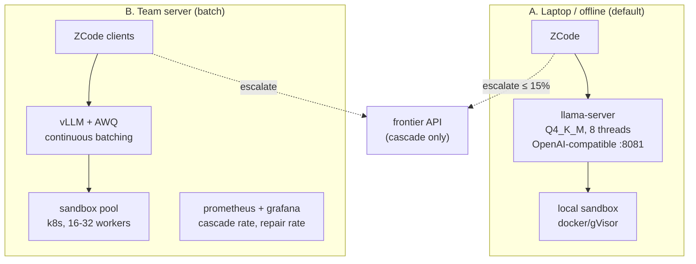
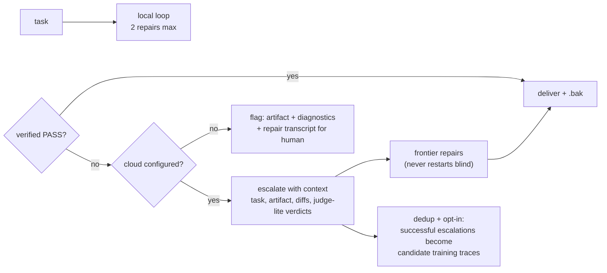

# Deployment — DocSLM-0.8B

How DocSLM ships, serves, integrates with ZCode, and stays observable in production.

---

## 1. Release artifacts

| Artifact | Contents | Size |
|---|---|---|
| `docslm-0.8b-v1.gguf` (Q4_K_M) | default build, text + vision | ~0.5 GB |
| `docslm-0.8b-v1-q5.gguf` / `-q8.gguf` | quality fallbacks | 0.65 / 1.1 GB |
| `docslm-0.8b-v1-awq/` | int4 GPU build for vLLM | ~0.7 GB |
| `skill-index-v1.db` | embeddings + BM25 over plugin corpus @0.1.4 | ~80 MB |
| `docslm-sbx.img` | pinned sandbox image (scripts, renderers, fonts) | ~1.5 GB |
| `lineage.json` | manifest hash, seeds, gate scores, eval report | KBs |

Bundle total ≤ 1 GB excluding the sandbox image (PRD footprint NFR); the sandbox is optional for non-edit routes and downloaded on first use.

## 2. Serving topologies

- **A (laptop):** single llama-server process; n_ctx 16384; KV cache q8_0. Verified targets on 8-core laptop: TTFT ≤ 400 ms @ 8k prompt, ≥ 25 tok/s decode, RSS ≤ 1.2 GB. Apple Silicon uses the MLX build with identical endpoints.
- **B (team server):** vLLM with the AWQ build, tool-call parser = OpenAI format; one GPU serves ~30 concurrent doc loops at ≥ 150 tok/s each; sandboxes autoscale on queue depth.

## 3. ZCode integration

1. **Model provider:** register `docslm-local` as an OpenAI-compatible provider pointing at the local llama-server. No ZCode core changes.
2. **Execution mode:** document-skills tasks get a workspace setting `docAgent.mode = "local-first" | "cloud" | "hybrid"`. `local-first` routes the loop to DocSLM with the cascade policy; `hybrid` runs local drafting + cloud final-judge.
3. **Context assembly module:** ships inside the plugin as the runtime packer (Architecture §3) — the skill corpus index ships with the plugin, so plugin updates update retrieval automatically (ADR-2).
4. **Opt-in and privacy UI:** first use shows resource expectations (RAM/disk) and telemetry choice (FR-16, local-only by default).

## 4. Cascade policy in production

The escalation cache closes the data flywheel: with user consent, cloud-repaired episodes flow back through the Data Engine's acceptance filters and improve the next checkpoint — the cascade rate is designed to shrink release over release.

## 5. Security model

| Layer | Control |
|---|---|
| Code execution | sandbox container: no network, seccomp, workspace path allowlist, 60 s CPU / 512 MB caps per call |
| File safety | edits staged as patches; originals copied to `.bak` before any write; path traversal rejected at the tool layer |
| Prompt injection | document *content* is always wrapped in a data fence; instructions inside attachments never elevate to system authority — verified by the red-team suite (Evaluation §6) |
| Model supply chain | GGUFs signed; lineage.json verified at install; sandbox image digest-pinned |
| Data egress | local-only mode makes zero network calls (escalation disabled); verified by e2e network monitor in CI |

## 6. Rollout plan

| Phase | Population | Mode | Exit criteria |
|---|---|---|---|
| 0 — shadow | internal team | cloud-primary, DocSLM runs in parallel, outputs compared | judge-agreement ≥ gate B; no latency interference |
| 1 — cascade-default | internal + opt-in beta | local-first + escalate | cascade ≤ 20%; no data-loss incidents over 2 weeks |
| 2 — local-default | beta population | local-first | cascade ≤ 15% (PRD G4); p50 UC-1 ≤ 45 s on reference laptop |
| 3 — GA | all | per-workspace choice | 2 consecutive weeks meeting all launch metrics |

**Observability in prod:** local histogram (route accuracy, repair success, cascade rate, latency) exported opt-in and anonymously; team-server mode gets full Prometheus/Grafana dashboards per stratum, with alerts on cascade-rate spikes (signals plugin-version drift → re-index + regression run).

**Versioning:** the skill corpus index is pinned to a plugin version range; a plugin update triggers index rebuild + 200-task smoke before the new corpus goes live — the model never silently meets unfamiliar skill files.

## 7. Support and lifecycle

- v1.x: quarterly refresh cadence — new data flywheel batch (§4), re-gate, re-release; old checkpoints remain pullable from the registry with their lineage cards.
- Deprecation: checkpoint replaced only after successor holds gate B for two consecutive nightly runs; rollback = swap GGUF file (endpoint contract is stable).
- Known v1 limitations to document for users (from PRD non-goals): no scanned-doc OCR, judge-lite advisory only, content authorship limited to supplied/outline material, L3 multi-artifact tasks most likely to cascade.
